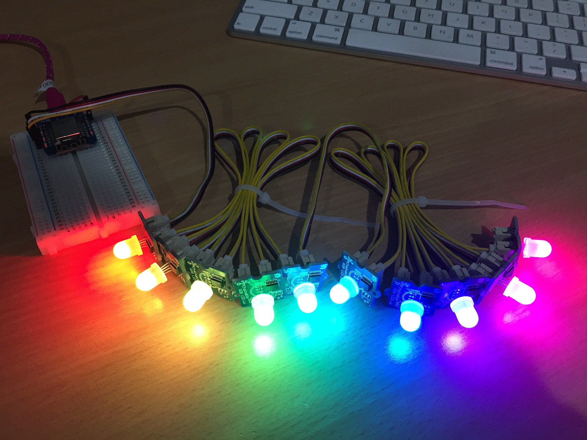

# MicroPython P9813

A MicroPython library for P9813 RGB LED drivers.

For example, the Seeed Studio [Grove - Chainable RGB LED](https://wiki.seeedstudio.com/Grove-Chainable_RGB_LED/).



## Example

Copy the file to your device, using ampy, webrepl or compiling and deploying. eg.

```
$ ampy put p9813.py
```

**Basic usage**

```python
import p9813

num_leds = 10
auto_write = False

# Using Hardware SPI
from machine import SPI, Pin

spi = SPI(1, 10000000, sck=Pin(18), mosi=Pin(23), miso=Pin(19))  # TinyPICO
chain = p9813.P9813_SPI(spi, num_leds, auto_write)

# Or using Software SPI
# from machine import SoftSPI, Pin
# spi = SoftSPI(baudrate=100000, polarity=1, phase=0, sck=Pin(4), mosi=Pin(5), miso=Pin(6))  # TinyS2
# chain = p9813.P9813_SPI(spi, num_leds, auto_write)

# Set the first LED to red. (red, green, blue)
# In a chain, the first LED is closest to the MCU
chain[0] = (255, 0, 0)

# Set the second LED to green
chain[1] = (0, 255, 0)

# Set third LED to blue and forth LED magenta
chain[2:4] = [(0, 0, 255), (255, 0, 255)]

# Write data to all LEDs
chain.write()

# What colour is the forth LED?
print(chain[3])
# (255, 0, 255)

# How many LEDs in the chain again?
print(len(chain))
# 10

# What are the first two colours?
print(chain[0:2])
# [(255, 0, 0), (0, 255, 0)]

# What are all the colours?
print(chain)
# [(255, 0, 0), (0, 255, 0), (0, 0, 255), (255, 0, 255), (0, 0, 0), (0, 0, 0), (0, 0, 0), (0, 0, 0), (0, 0, 0), (0, 0, 0)]

# Turn on auto-write, so you don't have to call write() after each change
chain.auto_write = True

# Make all LEDs red
chain.fill((255,0,0))

# Make all LEDs green
chain[0:10] = [
    (0, 255, 0),
    (0, 255, 0),
    (0, 255, 0),
    (0, 255, 0),
    (0, 255, 0),
    (0, 255, 0),
    (0, 255, 0),
    (0, 255, 0),
    (0, 255, 0),
    (0, 255, 0),
]

# Draw a rainbow by modifying the buffer directly
# Each 4 bytes = 1 LED (checksum, blue, green, red)
chain._buf = bytearray(b"\xc3\x00\x00\xff\xc6\x00K\xb4\xc9\x00\x99f\xcc\x00\xe4\x1b\xcc3\xcc\x00\xe4\x81~\x00\xf0\xcc3\x00\xf0\xe4\x00\x1b\xe1\x99\x00f\xd2K\x00\xb4")
chain.write()

# Turn off all LEDs
chain.reset()
```


## Bit Bang Version

This version works exactly like as the SPI version, only the serial data
is written by sending pulses on two output pins (clock and data).

### Bit Bang Example

**Basic Usage**

```python
import p9813

num_leds = 10
auto_write = False

from machine import Pin

pin_clk = Pin(4, Pin.OUT)
pin_data = Pin(5, Pin.OUT)
chain = p9813.P9813_BITBANG(pin_clk, pin_data, num_leds, auto_write)

# Make all LEDs red
chain.fill((255, 0, 0))

# Set the second LED to green
chain[1] = (0, 255, 0)

# Set the last 8 LEDs to blue
chain[2:] = [(0, 0, 255)] * 8

# Turn off all LEDs
chain.reset()
```

See [p9813_examples.py](p9813_examples.py) and [examples](examples/) for more.
## Chaining

You can connect multiple LEDs together to form a chain.
For each additional LED, an additional 4 bytes need to be sent per refresh.
The more LEDs you add, the longer it takes to write.


## Parts

* [Grove - Chainable RGB LED](https://www.seeedstudio.com/Grove-Chainable-RGB-LED.html)
* [Grove 4P Universal Buckled Cable](https://www.seeedstudio.com/Grove-Universal-4-Pin-Buckled-20cm-Cable-5-PCs-pack.html)
* [Grove 4P Male Dupont Conversion Cable](https://www.seeedstudio.com/Grove-4-pin-Male-Jumper-to-Grove-4-pin-Conversion-Cable-5-PCs-per-Pack.html)
* [TinyPICO](https://www.tinypico.com/)
* [TinyS2](https://unexpectedmaker.com/tinys2)
* [WeMos D1 Mini](https://www.aliexpress.com/item/32529101036.html)


## Connections

Grove Chainable RGB LED | TinyPICO (ESP32)
----------------------- | ----------------
CI (clock) (yellow)     | 4
DI (data) (white)       | 14
VCC (red)               | 3V3
GND (black)             | GND

Grove Chainable RGB LED | TinyS2 (ESP32s2)
----------------------- | ----------------
CI (clock) (yellow)     | 4
DI (data) (white)       | 5
VCC (red)               | 3V3
GND (black)             | GND

Grove Chainable RGB LED | WeMos D1 Mini (ESP8266)
----------------------- | -----------------------
CI (clock) (yellow)     | D2 (GPIO4)
DI (data) (white)       | D1 (GPIO5)
VCC (red)               | 3V3 (or 5V)
GND (black)             | GND

If you are using the bit-banged version, you can use any output GPIO pins for clock + data.

If you are using the SPI version, you need to use the SPI pins available to your MCU.

If you are chaining multiple LEDs, clock out -> clock in, data out -> data in, eg.

LED1 | LED2
---- | ----
CO   | CI (yellow)
DO   | DI (white)
VCC  | VCC (red)
GND  | GND (black)


## Links

* [micropython.org](http://micropython.org)
* [P9813 datasheet](docs/P9813_datasheet.pdf)
* [TinyPICO Getting Started](https://www.tinypico.com/gettingstarted)
* [WeMos D1 Mini](https://wiki.wemos.cc/products:d1:d1_mini)


## License

Licensed under the [MIT License](http://opensource.org/licenses/MIT).

Copyright (c) 2017 Mike Causer
